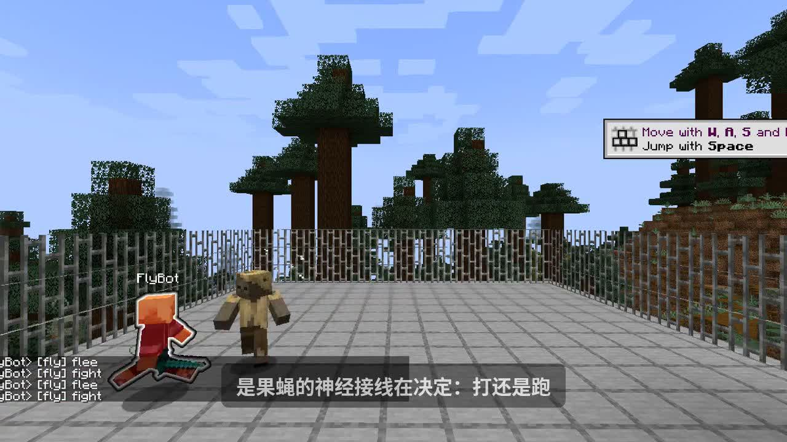

<div align="center">

# FlyCraft

### 把果蝇大脑，接进《我的世界》

**MaleCNS 连接组驱动的 Minecraft 战斗 NPC**  
*Fruit-fly connectome → a Minecraft NPC that hunts, fights, and flees*

<br/>


<br/>

**我把果蝇大脑接入了我的世界**  
*果蝇也能玩我的世界了*

<br/>

[](LICENSE)
[](#)
[](#data--credits--数据与致谢)
[](#实测成绩--benchmark)

</div>

---

## 🎬 Demo · 先看 24 秒

中文配音 · 平视多机位 · FlyBot 实机 **追 / 打 / 逃**

<div align="center">

<video src="media/flycraft_npc_promo.mp4" controls width="820" poster="media/cover.jpg">
  <a href="media/flycraft_npc_promo.mp4">Download flycraft_npc_promo.mp4</a>
</video>

<br/>



</div>

> 若 GitHub 预览未自动播，点开 [`media/flycraft_npc_promo.mp4`](media/flycraft_npc_promo.mp4) 即可下载观看。

---

## ✨ 一句话

用 **Google / Janelia 开源的 MaleCNS 果蝇连接组**，在 Minecraft 里驱动一个会 **追击、近战、掉血逃跑** 的 NPC。

**One line:** an open **MaleCNS** subgraph steering a live Minecraft NPC that **chases, fights, and flees**.

---

## 🚀 它能做什么 · What you get

<table>
<tr>
<td width="50%">

### 中文
- **连接组在线决策** — 约 8000 节点子图参与打 / 逃 / 游荡
- **敌对 NPC 手感** — 发现就追，贴身挥砍（约 0.5–1s 冷却）
- **会逃、会再战** — 受伤或被围拉开，再咬回来
- **多目标战场** — 多怪之间切换目标
- **可复现评测** — 自带 harness 打分
- **可讲科学故事** — 支持通路消融：剪边，战斗力下降

</td>
<td width="50%">

### English
- **Connectome-in-the-loop** on a ~8k-node MaleCNS-derived graph
- **Hostile-NPC combat** — chase → melee → retreat → re-engage
- **Multi-target** switching under pressure
- **Benchmark harness** with numeric scores
- **Ablation-ready** — cut pathways, watch behavior change
- **Promo-ready** media under `media/`

</td>
</tr>
</table>

### 实测成绩 · Benchmark

| 指标 Metric | 成绩 Score |
|-------------|----------:|
| Harness 总分 | **0.977** ✅ |
| 贴身追击 | **100%** |
| 近战间隔中位 | ~**712 ms** |
| 60s 命中 | **26** |
| 低血逃跑 | **8 / 8** |
| 无抗性存活 | ~**60 s** |

---

## ⚡ 快速开始 · Quick start

<details open>
<summary><b>① Headless（无需 Minecraft）</b></summary>

```bash
python3 -m venv .venv && source .venv/bin/activate
pip install -e ".[dev]"
./scripts/run_headless.sh
pytest -q
```

</details>

<details>
<summary><b>② Live · 接入 Paper 1.20.4</b></summary>

```bash
npm install
export FLYCRAFT_CONFIG=configs/malecns.yaml
export MC_HOST=127.0.0.1 MC_PORT=25565 MC_USERNAME=FlyBot
node bridge-js/live_bot.js
```

</details>

<details>
<summary><b>③ 一键评测 Harness</b></summary>

```bash
bash scripts/run_npc_harness.sh demo
```

</details>

---

## 🧠 架构 · Architecture

```text
 Minecraft (Paper 1.20.4)
           ↕  Mineflayer
  感知：血量 / 敌对 / 可见性 / 受伤方向
           ↓
  MaleCNS 子图动力学  (~8000 nodes)
           ↓
     打 · 逃 · 游荡 · 再交战
           ↓
   追击 / 挥砍 / 后撤（实机动作）
```

| 模块 | 作用 |
|------|------|
| `flycraft/sim/live_server.py` | 连接组控制器 |
| `bridge-js/live_bot.js` | 游戏里的手和脚 |
| `data/malecns/` | 子图与数据说明 |
| `harness/` | NPC 能力评测 |
| `media/` | 宣传片与封面 |
| `docs/` | 计划、进度、架构 |

---

## 📦 Data & credits · 数据与致谢

- 上游：**MaleCNS** — Google Research & HHMI Janelia（**CC-BY**）
- 本仓库：MaleCNS **衍生子图** + **MIT** 工程代码
- 口号：*我把果蝇大脑接入了我的世界*

使用与传播时请保留对 **MaleCNS / Google / Janelia** 的署名。

---

## 🔥 What’s next · 下一步更炸

1. **拔线对照** — 完整脑 vs 敲掉通路，角色当场变笨  
2. **果蝇打靶** — 连接组决定开不开火  
3. **一窝果蝇 NPC** — 群感围猎  

More in [`docs/`](docs/).

---

## License

**MIT** (code) · MaleCNS data **CC-BY** (attribute Google / Janelia)

---

<div align="center">

### 果蝇大脑 × 我的世界

*Open connectome. Real game. Reactive NPC.*

</div>
